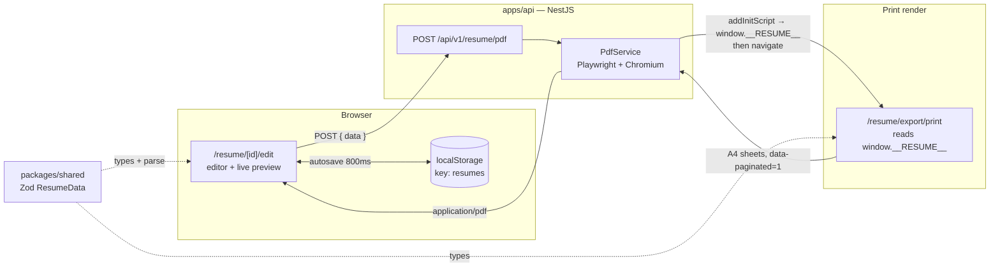

# Resume Builder

A resume builder with a **true-to-print live preview** and **server-rendered PDF export**.

You edit on the left, and the right-hand side shows real A4 sheets — paginated exactly the way the
exported PDF will be, because the preview and the PDF are rendered by the same React component. Two
layouts ship out of the box: a designed serif layout, and a plain single-column layout optimised for
ATS parsers.

Built as a TypeScript monorepo: a Next.js front end, a NestJS PDF service that drives headless
Chromium, and a shared Zod schema that both sides validate against.

---

## Demo

A walkthrough of the dashboard, the editor, the live preview, the layout switch and the PDF export.

<!--
  ▲ PASTE THE GITHUB ASSET URL BELOW to make the video play inline.

  GitHub will not play a video from a repo path — it only renders a player for URLs it
  minted itself (github.com/user-attachments/assets/…). To get one:

    1. Go to https://github.com/SyrineLarbi/resume_builder/issues/new
    2. Drag "resume Demo.mp4" into the comment box and wait for the upload to finish
    3. GitHub inserts a line like:
         https://github.com/user-attachments/assets/2b7f9c14-...-a91e
    4. Copy that URL, then CLOSE the tab without submitting the issue
    5. Replace the src="" below with it, and delete the fallback link underneath

  Then it plays right inside this README.
-->

<video src="" controls muted width="720">
  Your browser can't play this video inline.
</video>

▶️ **[Watch the demo — resume Demo.mp4](./resume%20Demo.mp4)** *(7.1 MB — opens GitHub's file
viewer; use the **Download** button if it doesn't play there)*

---

## Features

| | |
| --- | --- |
| **Live A4 preview** | Real page sheets with page counters, not an approximation. What you see is what the PDF contains. |
| **Word-style pagination** | Content blocks are measured and packed; a block that doesn't fit moves *whole* to the next page. Section headings never get orphaned at the bottom of a page. |
| **Two layouts** | `styled` — EB Garamond serif on cream, accent colour, optional photo. `ats` — Arial, black on white, single column, no photo or icons for maximum parseability. Switch at any time. |
| **Server-side PDF** | Rendered by headless Chromium at exact A4 with zero margin, so typography and page breaks are deterministic rather than dependent on the visitor's browser print dialog. |
| **Multiple resumes** | Create, rename, duplicate-by-hand and delete from the dashboard, each with its own layout. |
| **Autosave** | Debounced at 800 ms while you type. |
| **Photo upload** | Read client-side and embedded inline as a data URL. |
| **Self-hosted fonts** | EB Garamond ships as `woff2` in the repo, so preview and PDF use byte-identical fonts. |
| **Full sections** | Header/contacts, summary, grouped skills, experience with bullets, projects with tech + links, education, languages. |

---

## Screens

| Route | What it is |
| --- | --- |
| `/` | Redirects to `/dashboard` |
| `/dashboard` | Resume list — create, open, delete |
| `/resume/[id]/edit` | The editor: form on the left, live paginated preview on the right |
| `/resume/[id]/print` | Print-only route. Renders nothing but the paginated sheets — this is the page headless Chromium screenshots to PDF |
| `/template-test` | A static harness for eyeballing the styled template against fixed sample data |

---

## Architecture



### The part worth understanding: how PDF export works

There is no server-side template engine and no PDF drawing library. The PDF is a **screenshot of the
real app**, which is what guarantees it matches the preview:

1. The browser POSTs the resume it holds in memory to `POST /api/v1/resume/pdf`.
2. `PdfService` launches (or reuses) a Chromium instance and opens a fresh context.
3. It injects the posted resume with `page.addInitScript` as `window.__RESUME__` — **before** any
   page script runs.
4. It navigates to `${PUBLIC_WEB_URL}/resume/export/print`. That page reads `window.__RESUME__` on
   first render, so there is no server-side fetch and nothing is persisted.
5. It waits for `document.fonts.ready`, then for the client-side paginator to set
   `<html data-paginated="1">` — the signal that the A4 sheets have finished laying out.
6. `page.pdf({ format: 'A4', printBackground: true, margin: 0 })`. Margin is zero on purpose: each
   sheet already supplies its own 14 mm padding, so sheets map 1:1 onto PDF pages.
7. The buffer streams back as `application/pdf`.

The browser instance is held across requests and closed on `onModuleDestroy`, so only the first
export pays the Chromium launch cost.

> **Note:** the URL is `/resume/export/print` while the route file is `app/resume/[id]/print/page.tsx`.
> The literal `export` is just what lands in `[id]`; the print page ignores it and reads the injected
> global instead.

### Pagination

`PaginatedResume` is the single component behind both the preview and the print route.

- Page geometry: **210 × 297 mm**, **14 mm** margins → 182 mm content width, ≈ **1016 px** of usable
  height at 96 dpi.
- Templates don't return one big tree — they return an array of **blocks** (`{ id, keepWithNext, node }`).
- A hidden measurement pass renders every block at the exact content width and records each one's
  effective height (distance to the next block's top, so collapsed margins are captured correctly).
- Blocks are then packed greedily. A block that doesn't fit the remaining space moves whole to the
  next page — nothing is ever split mid-block.
- `keepWithNext` blocks (section headings, and entry headers that have bullets under them) are pulled
  down with their content instead of being left stranded.
- On screen the same sheets are rendered scaled with a `Page n / N` label; for print they get real
  `break-after: page`.

### Storage

**Resumes are stored in the browser's `localStorage`** under the key `resumes`. There is no database
and no user accounts — `apps/web/lib/api.ts` is a local-storage repository that exposes an
async, API-shaped interface. The backend is used *only* to render PDFs and stores nothing.

The practical consequence: resumes live on one browser on one machine. Clearing site data loses them.

---

## Monorepo layout

```
resume_builder/
├── apps/
│   ├── api/                        @portfolio/api — NestJS 11
│   │   └── src/
│   │       ├── main.ts             bootstrap, CORS, 15 MB body limit, /api/v1 prefix
│   │       ├── app.module.ts
│   │       └── resume/
│   │           ├── pdf.controller.ts   POST /resume/pdf
│   │           └── pdf.service.ts      Playwright → A4 PDF
│   └── web/                        @portfolio/web — Next.js 16 App Router
│       ├── app/
│       │   ├── dashboard/          resume list
│       │   ├── resume/[id]/edit/   editor (584 lines — the bulk of the UI)
│       │   ├── resume/[id]/print/  print-only route for the PDF renderer
│       │   └── template-test/      static visual harness
│       ├── components/resume/
│       │   ├── paginated-resume.tsx    the A4 paginator
│       │   ├── resume-template.tsx     styled layout → blocks
│       │   ├── ats-template.tsx        ATS-plain layout → blocks
│       │   └── resume-theme.css        scoped palettes + @font-face
│       ├── components/ui/          button, input, label, textarea
│       ├── lib/api.ts              localStorage repository + renderPdf()
│       └── public/fonts/           self-hosted EB Garamond woff2
├── packages/
│   └── shared/                     @portfolio/shared — the Zod contract
├── Dockerfile                      API image (Node 20 + Chromium) for Railway
├── turbo.json
└── resume Demo.mp4                 demo walkthrough
```

### The shared contract

`packages/shared/src/index.ts` defines `ResumeData` in Zod, and it is deliberately the **only**
definition of a resume's shape — the API validates against it, the editor's state is typed by it, and
both templates plus the print route consume it. Renaming a field is a compile error everywhere.

```ts
ResumeData = {
  id, name, layout: 'styled' | 'ats',
  fullName, title, photoUrl?, email, phone?, location?,
  website?, github?, linkedin?, summary?,
  experiences: [{ title, company?, companyNote?, location?, startDate?, endDate?, bullets[] }],
  skills:      [{ heading, items[] }],
  projects:    [{ title, technologies?, description?, bullets[], githubUrl?, demoUrl? }],
  languages:   [{ name, level? }],
  education:   [{ degree, institution?, detail?, location?, startDate?, endDate? }],
}
```

Every field carries a schema default, so `ResumeData.parse({ id })` produces a complete blank resume —
which is exactly how `createResume()` works. Dates are plain strings (`"2024/01"`); an empty
`endDate` renders as *Present*.

---

## Getting started

### Prerequisites

- **Node.js ≥ 20**
- **npm 10.9.4** (declared as `packageManager`; run `corepack enable` to match it)
- Chromium for Playwright, installed once on first setup

### Install

```bash
git clone https://github.com/SyrineLarbi/resume_builder.git
cd resume_builder
npm ci
npx playwright install --with-deps chromium   # needed by the PDF service
```

### Environment

Neither app ships a `.env` file — create these two:

`apps/web/.env.local`

```bash
NEXT_PUBLIC_API_BASE_URL=http://localhost:4000/api/v1
```

`apps/api/.env`

```bash
PORT=4000
PUBLIC_WEB_URL=http://localhost:3000   # the URL Chromium opens to render the print route
WEB_ORIGIN=http://localhost:3000       # extra allowed CORS origin
```

`PUBLIC_WEB_URL` is the one to get right — if it doesn't point at a running web app, PDF export fails
because Chromium has nothing to render.

### Run

```bash
npm run dev        # turbo: shared (tsc --watch) + api (:4000) + web (:3000)
```

Then open <http://localhost:3000>. Create a resume, fill it in, and click **Download PDF**.

To run one app at a time:

```bash
npm run dev --workspace @portfolio/web
npm run dev --workspace @portfolio/api
```

`packages/shared` must be built at least once before the apps type-check — `turbo` handles that via
`dependsOn: ["^build"]`, but if you skip `npm run dev` and go straight to a single workspace, run
`npm run build --workspace @portfolio/shared` first.

---

## Scripts

Run from the repository root:

| Command | Does |
| --- | --- |
| `npm run dev` | All three packages in watch mode |
| `npm run build` | Builds shared → api → web in dependency order |
| `npm run lint` | ESLint across the workspace |
| `npm run typecheck` | `tsc --noEmit` across the workspace |
| `npm run format` | Prettier over `ts,tsx,js,jsx,json,md` |

API-only:

| Command | Does |
| --- | --- |
| `npm run test --workspace @portfolio/api` | Jest unit tests |
| `npm run test:e2e --workspace @portfolio/api` | Supertest e2e |
| `npm run start:prod --workspace @portfolio/api` | `node dist/main.js` |

---

## API

Base path: `/api/v1`.

### `POST /resume/pdf`

Renders a resume to PDF. Unauthenticated, and nothing is stored.

```http
POST /api/v1/resume/pdf
Content-Type: application/json

{ "data": { /* a full ResumeData object */ } }
```

Responds `200` with `Content-Type: application/pdf` and
`Content-Disposition: attachment; filename="resume.pdf"`.

```bash
curl -X POST http://localhost:4000/api/v1/resume/pdf \
  -H 'content-type: application/json' \
  -d '{"data":{"id":"demo","fullName":"Jane Doe","email":"jane@example.com","layout":"ats"}}' \
  --output resume.pdf
```

The JSON body limit is raised to **15 MB** (Nest's default 100 kB rejects resumes carrying an inline
base64 photo).

### `GET /`

Still the NestJS scaffold's `"Hello World!"`. Useful as a crude liveness check; not a real health
endpoint.

### CORS

Allowed origins: any `http://localhost[:port]`, the value of `WEB_ORIGIN`, and any `*.vercel.app`
host.

---

## Deployment

The `Dockerfile` at the root builds **the API only**, from the repository root as build context
(it needs `packages/shared`). It is written for Railway:

- `node:20-bookworm-slim`, `npm ci`, then `npx turbo run build --filter=@portfolio/api`
- `npx playwright install --with-deps chromium` in the runtime stage — the image must ship Chromium
  and its system libraries, which is the reason a plain buildpack won't do
- Starts `node dist/main.js` from `apps/api`, reading `$PORT`

The front end is a standard Next.js app and deploys to Vercel unchanged — the CORS rule already
allows `*.vercel.app`.

Set `PUBLIC_WEB_URL` on the API to the deployed web URL, and `NEXT_PUBLIC_API_BASE_URL` on the web app
to the deployed API URL + `/api/v1`. They point at each other; getting one wrong breaks PDF export in
a way that looks like a front-end bug.

---

## Tech stack

| Layer | Choice |
| --- | --- |
| Monorepo | npm workspaces + Turborepo 2.5 |
| Front end | Next.js 16.2.9 (App Router), React 19.2.4 |
| Styling | Tailwind CSS v4 (`@tailwindcss/postcss`), `clsx` + `tailwind-merge` |
| Icons | lucide-react |
| Fonts | Geist (app UI, `next/font`), self-hosted EB Garamond woff2 (resume) |
| Back end | NestJS 11 on Express, `class-validator` + `class-transformer`, global `ValidationPipe` |
| PDF | Playwright 1.61 + headless Chromium |
| Contract | Zod 3 in `@portfolio/shared` |
| Language | TypeScript 5.7 |
| Tests | Jest + Supertest (API scaffold) |

---

## Known limitations

Worth knowing before building on this:

- **Single-device storage.** Resumes live in `localStorage`; there is no database, no accounts, and no
  sync. Clearing browser data deletes them.
- **No authentication.** The PDF endpoint is open — anyone who can reach it can render a PDF from any
  payload they post.
- **The API needs the web app.** PDF export navigates to `PUBLIC_WEB_URL`, so the API cannot render
  anything on its own.
- **No `.gitignore`.** Build output is currently tracked (`packages/shared/dist/`,
  `apps/web/tsconfig.tsbuildinfo`); adding one and untracking those is a quick win.
- **No `.env.example`.** The four variables above are only discoverable by reading the source.
- **`GET /`** is still the framework's placeholder rather than a real health check.
- **Pagination is measurement-based**, so a font that fails to load can change where pages break. The
  renderer waits on `document.fonts.ready` to guard against this, and the resume fonts are
  self-hosted for that reason.
- **Test coverage is the NestJS scaffold.** The paginator and the templates — the genuinely tricky
  parts — have no tests yet.

---

## License

UNLICENSED / private.
